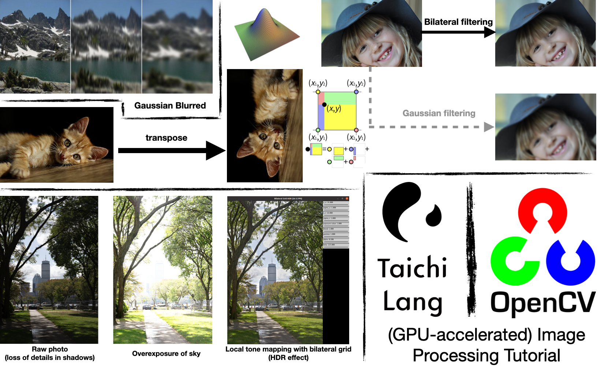
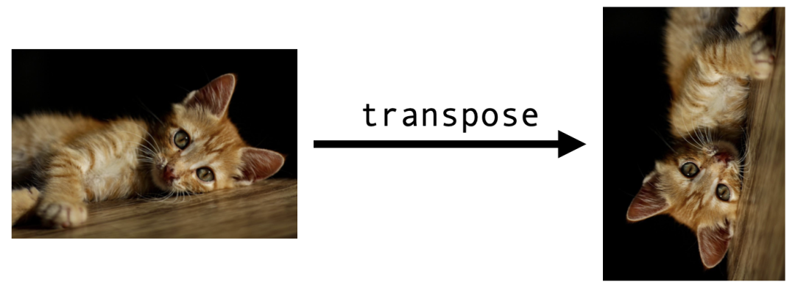

In the [previous blog](https://docs.taichi-lang.org/blog/accelerate-python-code-100x), we talked about how to use Taichi to accelerate Python programs. Many of our readers are curious about whether Taichi can fuel specifically *image processing tasks*, work together with OpenCV (`import cv2`), and even process images in parallel on GPUs. Well, in this article we will strive to provide answers to these questions. 

To make your reading experience less tedious, we will take the beauty filters and the HDR effect of the popular console game *Ghost of Tsushima* as examples to elaborate on image processing algorithms, including the Gaussian filter, the bilateral filter, and the bilateral grid, in ascending order of difficulty. You are recommended to write code as you read on, and we're sure you will not close this page empty-handed whether you are familiar with image processing or not. We hope that this article can serve you well, and we look forward to your feedback, positive or negative :)

## Introduction

Python is one of the most widely used languages for image processing. In computer vision and other rapidly evolving sectors, Python is considered the go-to option for many researchers when they conduct fast algorithm prototyping and verification, especially in scenarios like image pre-processing and model training. OpenCV, a popular image processing library, also provides a Python encapsulation so that users can write Python code to call underlying C++ algorithms and get performance gains.

<center>


</center>

However, real-life R&D does not always go as expected. More often than not, an OpenCV interface alone is far from being a panacea: You will find Python less attractive when you have to implement by yourself some image processing algorithms that OpenCV does not supply. It is unbearably slow to run for loops in Python to iterate over the pixels of images, which are usually stored in memory as NumPy arrays. In addition, the overhead incurred by the Python interpreter constitutes an annoying performance bottleneck when real-time processing (such as camera feeds) or large amounts of data are involved.

Here's when Taichi comes into play:

- The outermost for loops in a Taichi kernel are automatically parallelized, and users won't be bothered with thread allocation or management.
- Taichi's just-in-time (JIT) compiler compiles the Taichi code to fast machine code, which is executed on the multi-core CPU or GPU backend. Users are freed from compilation and system adaptation pitfalls.
- Taichi switches effortlessly between CPU and GPU execution.
- Taichi saves the need to call separately written C++/CUDA code in Python via ctypes or pybind 11 and thus enhances coding convenience and portability. Users can switch freely back and forth between OpenCV implementations and Taichi implementations, keeping everything within one Python program.

With the features listed above, Taichi not only maximizes the simplicity of coding in Python, but also achieves high performance on par with C++/CUDA. 

So much for the theory. Let's get down to practice. This article is composed of three sections to explain how Taichi accelerates image processing in Python:

I. [An entry-level case: Image transposition and bilinear interpolation](#an-entry-level-case-image-transposition-and-interpolation)
II. An intermediate case:  Gaussian filtering and bilateral filtering
III. An advanced case: Bilateral grid and high dynamic range (HDR) tone mapping

We will demonstrate, step by step, how image processing algorithms evolve, and explore some of their fascinating applications. In the end, we will summarize things you need to keep in mind when using Taichi for image processing and also discuss Taichi's current limitations for future improvement.

One final thing before the kick-start: Make sure you have installed the latest Taichi and opencv-python on your machine:

```bash
pip3 install -U taichi opencv-python
```

All source code used in this article is available at this repo: [Image processing with Taichi](https://github.com/taichi-dev/image-processing-with-taichi).

## An entry-level case: Image transposition and interpolation

### Image transposition

Let's start with a basic example, image transposition, to familiarize you with the essential steps of image processing with Taichi.

Similar to matrix transposition, image transposition entails swapping the positions of the pixels at $(i, j)$ and $(j, i)$.



We first import the libraries we need. An indispensable step for each Taichi program is initiation via `ti.init()`:

```python
import cv2
import numpy as np
import taichi as ti

ti.init()
```

Then, read the cat image into memory:

```python
src = cv2.imread("./images/cat.jpg")
h, w, c = src.shape
dst = np.zeros((w, h, c), dtype=src.dtype)

img2d = ti.types.ndarray(element_dim=1) # Color image type
```

Most of the image processing libraries available in Python assume that images exist in the form of NumPy arrays, and so does OpenCV. A (single-channel) grayscale image is represented with a 2D array of the shape (height, width); a (multi-channel) color image corresponds to a 3D array of the shape (height, width, channels). In the code snippet above, the image `src` read by OpenCV is a 3D NumPy array, and we subsequently declare `dst`, which is of the same data type as `src` yet with swapped height and width, for storing the transposed image. 

Now, we involve the function `transpose()` to deal with the transposition. Looking exactly like a Python function, `transpose()` actually serves as a Taichi kernel here since it is decorated with `ti.kernel`:

```python
@ti.kernel
def transpose(src: img2d, dst: img2d):
    for i, j in ti.ndrange(h, w):
        dst[j, i] = src[i, j]
```

This is a neat but important kernel. To write it properly, we need to understand the following:

- `src` and `dst` in Line 2 represent the input and output images, respectively. They are both type-annotated by `img2d = ti.types.ndarray(element=1)`. Taichi allows you to pass a NumPy array as an argument to a kernel through `ti.types.ndarray()`. You can ignore the meaning of `element_dim` for now, except that it enables us to manipulate the three channels of a pixel at the same time. The array is *passed by pointer* without generating an extra copy (but automatic CPU/GPU data transfer occurs on the GPU backend). In this way, any modification of the passed argument in the kernel affects the original array.
- `for i, j in ti.ndrange(h, w)` is the outermost for loop in the kernel. It automatically iterates over all the elements in the array in parallel. Specifically, `i` traverses all the rows and `j` all the columns. 

Finally, call the kernel and save `dst` as an image:

```python
transpose(src, dst)
cv2.imwrite("cat_transpose.jpg", dst)
```

*And the output is the transposed image.*

Source code: [image_transpose.py](https://github.com/taichi-dev/image-processing-with-taichi/blob/main/image_transpose.py)

### Bilinear interpolation 

Image transposition is friendly enough for beginners, isn't it? Now we are ready to increase the difficulty level a bit.

Bilinear interpolation is a technique frequently used for image upsampling. Suppose the cat image we have has a size of 96x64 pixels only, and now we want to enlarge it five times into 480x320 pixels. Magnifying each pixel into a 5x5 mosaic may not be a good idea:

<center>


Upsampling by enlarging each pixel five times
</center>

For a pixel $(i, j)$ in the output image, its corresponding position in the original image is $P=(i/5, j/5)$, which does not necessarily coincide with any pixel of the input. Rounding $P$ up or down to the nearest pixel produces the mosaic effect as above.

Bilinear interpolation takes a different approach. It captures the four pixels around $P$ and returns the weighted mean of their pixel values:

<center>


Image source: [Wikipedia](https://en.wikipedia.org/wiki/Bilinear_interpolation)
</center>

The four pixels surrounding $P=(x,y)$ are:
$$Q_{11}=(x_1,y_1),\ Q_{12}=(x_1,y_2),\ Q_{21}=(x_2,y_1),\ Q_{22}=(x_2,y_2)$$ 

They form a unit square, whose area (equivalent to the sum of the areas of the four rectangles) is 1. The weight of each pixel is the area of the rectangle in the same color as the pixel. For example, if $P$ moves closer to the yellow pixel $Q_{12}$ in the upper left corner, the yellow rectangle at the bottom right will become larger, assigning a larger weight to $Q_{12}$. 

We can now perform three 1D linear interpolations. We first adopt the weight $x-x_1$ to perform interpolations on the pairs $(Q_{11},Q_{21})$ and $(Q_{12},Q_{22})$, respectively, and get the results $R_{1}$ and $R_{2}$. Then, interpolate $(R_{1},R_{2})$ with the weight $y-y_1$.

```python
import taichi.math as tm

@ti.kernel
def bilinear_interp(src: img2d, dst: img2d):
    for I in ti.grouped(dst):
        x, y = I / scale
        x1, y1 = int(x), int(y)  # Bottom-left corner
        x2, y2 = min(x1 + 1, h - 1), min(y1 + 1, w - 1)  # Top-right corner
        Q11 = src[x1, y1]
        Q21 = src[x2, y1]
        Q12 = src[x1, y2]
        Q22 = src[x2, y2]
        R1 = tm.mix(Q11, Q21, x - x1)
        R2 = tm.mix(Q12, Q22, x - x1)
        dst[I] = ti.round(tm.mix(R1, R2, y - y1), ti.u8) # Round into uint8
```

In the code snippet above, the 2D index `I`, which denotes the coordinate of a pixel in the output image dst, traverses all the pixels in `dst`. `I/scale` returns $(x,y)$, which is `I`'s corresponding position in the input image `src`. $R_1$ represents the horizontal interpolation between the pixels $Q_{11}=(x_1,y_1)$ and $Q_{21}=(x_2, y_1)$, and $R_2$ represents the horizontal interpolation between the pixels $Q_{12}=(x_1,y_2)$ and $Q_{22}=(x_2, y_2)$. The final output pixel value is derived after finishing the vertical interpolation between $R_1$ and $R_2$.

`tm.mix()` above is the function that performs the 1D interpolation. It is provided by the `taichi.math` module and defined as follows:

```python
@ti.func
def mix(x, y, a): # also named "lerp" in other libraries
    return x * (1 - a) + y * a
```

*A comparison of the mosaic effect and bilinear interpolation:*

<center>


Enlarging each pixel five times


Bilinear interpolation
</center>

*Obviously, the output image of bilinear interpolation is more natural.*

Source code: [image_bilinear_inpterpolation.py](https://github.com/taichi-dev/image-processing-with-taichi/blob/main/image_bilinear_inpterpolation.py)

## An intermediate case: Gaussian filtering and bilateral filtering

### Gaussian filtering

Gaussian filtering is one of the most widely used filtering algorithms in the field of image processing. It attenuates the high-frequency information to smoothen and blur an image. A Gaussian filter convolves a 2D image with a matrix named a Gaussian kernel, whose elements are derived from the sampling of the 2D Gaussian distribution.

<center>


A 2D Gaussian convolution kernel. 
Image source: *Fast Bilateral Filtering for the Display of High-Dynamic-Range Images* by Durand and Dorsey, SIGGRAPH 2006
</center>

The probability density function of the 2D Gaussian distribution is 
$$G(x,y) = \frac{1}{2\pi\sigma^2}\mathrm{e}^{-\frac{x^2+y^2}{2\sigma^2}}$$

For a $(2k+1)\times (2k+1)$ Gaussian kernel $K$, its elements are derived from $G(x,y)$ sampled at the points falling within ${(i,j)\mid-k\leq i,j\leq k}$. For example, the following is a 3x3 Gaussian kernel:
$$K = \begin{bmatrix}G(-1,-1
)&G(0, -1) & G(1,-1)\\ G(-1,0)& G(0,0) & G(1, 0)\\ G(-1, 1)& G(0,1) & G(1, 1)\end{bmatrix}$$

Given that $G(x,y) = \frac{1}{\sqrt{2\pi\sigma^2}}\mathrm{e}^{-\frac{x^2}{2\sigma^2}} \cdot \frac{1}{\sqrt{2\pi\sigma^2}}\mathrm{e}^{-\frac{y^2}{2\sigma^2}} = G_1(x)G_1(y)$ denotes the product of two 1D density functions, the Gaussian kernel is separable. $K$ can be represented as the product of a 1D vector $v=(G_1(-k),G_1(-k+1),\ldots,G_1(k))^T$ and the transpose of the vector:
$$K=v\cdot v^T$$

Accordingly, the convolution between an image and the kernel $K$ can be separated into two 1D convolution operations, i.e., convolution of each column using $v$ and convolution of each row using $v^T$ ([this website](http://www.songho.ca/dsp/convolution/convolution.html#convolution_2d) provides a proof). In this way, the 2D convolution $O(m*n*k^2)$ is simplified into $O(m*n*k)$.

<center>


From left to right: the original image, the intermediate result of vertical filtering, and the final result of complete Gaussian filtering ($\sigma$=5.0)
Input image source: [Wikipedia](https://en.wikipedia.org/wiki/Bilateral_filter)
</center>

To write the program in Taichi, we should first create a 1D field (essentially a 1D data array) for storing the 1D Gaussian kernel:

```python
weights = ti.field(dtype=float, shape=1024, offset=-512)
```

The field's shape is set to 1,024, which would suffice to meet the needs of most scenarios. Note that `offset=-512` means that the field index starts from -512 and ends with 511. The offset feature provided by Taichi helps simplify coding by ensuring the index range is symmetrical about the origin.

Initialize this field using `@ti.func`:

```python
@ti.func
def compute_weights(radius: int, sigma: float):
    total = 0.0
    ti.loop_config(serialize=True)
    for i in range(-radius, radius + 1):
        val = ti.exp(-0.5 * (i / sigma)**2)
        weights[i] = val
        total += val

    ti.loop_config(serialize=True)
    for i in range(-radius, radius + 1):
        weights[i] /= total
```

The parameter `radius` controls the size of the Gaussian kernel – the element index of the kernel ranges between `[-radius, radius]`. `sigma` represents the variance of the Gaussian density function.

One thing worth attention is that `ti.loop_config(serialize=True)` disables the parallelization of the immediately following for loop. It is more efficient to serialize the for loops for non-intensive computation tasks to avoid the heavy thread overhead generated on CPUs/GPUs. We can safely ignore the coefficient $1/{2\pi\sigma^2}$ when computing each element of the Gaussian kernel, and use the variable `total` for the final normalization.

We now get down to the two 1D convolution operations. Declare a 1,024x1,024 vector field (essentially a 2D data array whose elements are RGB values) for storing the intermediate image after the first filtering:

```python
img = cv2.imread('./images/mountain.jpg')
img_blurred = ti.Vector.field(3, dtype=ti.u8, shape=(1024, 1024))
```

Conduct the vertical and horizontal 1D filtering, consecutively:

```python
@ti.kernel
def gaussian_blur(img: img2d, sigma: float):
    img_blurred.fill(0)
    blur_radius = ti.ceil(sigma * 3, int) 
    compute_weights(blur_radius, sigma)

    n, m = img.shape[0], img.shape[1]
    for i, j in ti.ndrange(n, m):
        l_begin, l_end = max(0, i - blur_radius), min(n, i + blur_radius + 1)
        total_rgb = tm.vec3(0.0)
        for l in range(l_begin, l_end):
            total_rgb += img[l, j] * weights[i - l]

        img_blurred[i, j] = total_rgb.cast(ti.u8)

    for i, j in ti.ndrange(n, m):
        l_begin, l_end = max(0, j - blur_radius), min(m, j + blur_radius + 1)
        total_rgb = tm.vec3(0.0)
        for l in range(l_begin, l_end):
            total_rgb += img_blurred[i, l] * weights[j - l]

        img[i, j] = total_rgb.cast(ti.u8)
```

In the code snippet above, Lines 3-5 set the post-filtering image to 0 and initialize the Gaussian filter. The following two for loops, as defined by Lines 7-14 and Lines 16-22, respectively, are essentially the same, except that the first for loop saves the column filtering results in `img_blurred` and the second for loop saves results back to the input image `img`.

With preparation done, we can compute the product of the filter's elements and the elements of `img`. It is as simple as that!

Source code: [gaussian_filter_separate.py](https://github.com/taichi-dev/image-processing-with-taichi/blob/main/gaussian_filter_separate.py)

### Bilateral Filtering

Adopting fixed weights, Gaussian filtering effectively smoothens images but inevitably losses some details. As a result, image edges are usually blurred.

Can we *preserve the details on the edges* when smoothening an image? An idea is that an additional weighting factor can be introduced to reflect the difference in pixel values since Gaussian filtering only considers the distance between pixels. This is what bilateral filtering does.

<center>


Image source: *Fast Bilateral Filtering for the Display of High-Dynamic-Range Images* by Durand and Dorsey, SIGGRAPH 2006
</center>

As the image above shows, we create a 3D surface plot out of a 2D (single-channel) grayscale image, with the heights representing pixel values. Thanks to bilateral filtering, the output image has smooth slopes and preserves clear cliffs (i.e., the edges).

$$I^{\text{filtered}}(x) = \frac{1}{W_p}\sum_{x_i\in\Omega}I(x_i)G_{\sigma_r}(\|I(x_i)-I(x)\|)G_{\sigma_s}(\|x_i-x\|)$$

$G_{\sigma_s}$ refers to the distance-based Gaussian kernel, as explained in the last section, and $G_{\sigma_r}$ is a new Gaussian kernel determined by the difference in pixel values: 
$$G_{\sigma_r}(|I(x_i)-I(x)|)=\frac{1}{\sqrt{2\pi\sigma_r^2}}\mathrm{e}^{-\frac{|I(x_i)-I(x)|^2}{2\sigma_r^2}}$$

$W_P$ is the normalization coefficient. The weight carried by the pixel $(k,l)$ for filtering the pixel $(i,j)$ can be denoted as
$$w(i, j, k, l) = \mathrm{exp}\left({-\frac{(i-k)^2+(j-l)^2}{2\sigma_s^2} -\frac{|I(i, j)-I(k, l)|^2}{2\sigma_r^2}}\right)$$

The equation indicates that the bigger the difference in pixel values $|I(i,j)-I(k,l)|$ is, the smaller the weight is allocated to $I(k,l)$. Therefore, the image edges are kept relatively intact.

<center>


Left: Original image. Right: Output image of bilateral filtering
</center>

The bilateral filter cannot be separated into two 1D convolution operations. So we have to write the 2D convolution patiently:

```python
img_filtered = ti.Vector.field(3, dtype=ti.u8, shape=(1024, 1024))

@ti.kernel
def bilateral_filter(img: img2d, sigma_s: ti.f32, sigma_r: ti.f32):
    n, m = img.shape[0], img.shape[1]

    blur_radius_s = ti.ceil(sigma_s * 3, int)

    for i, j in ti.ndrange(n, m):
        k_begin, k_end = max(0, i - blur_radius_s), min(n, i + blur_radius_s + 1)
        l_begin, l_end = max(0, j - blur_radius_s), min(m, j + blur_radius_s + 1)
        total_rgb = tm.vec3(0.0)
        total_weight = 0.0
        for k, l in ti.ndrange((k_begin, k_end), (l_begin, l_end)):
            dist = ((i - k)**2 + (j - l)**2) / sigma_s**2 + (img[i, j].cast(
                ti.f32) - img[k, l].cast(ti.f32)).norm_sqr() / sigma_r**2
            w = ti.exp(-0.5 * dist)
            total_rgb += img[k, l] * w
            total_weight += w

        img_filtered[i, j] = (total_rgb / total_weight).cast(ti.u8)

    for i, j in ti.ndrange(n, m):
        img[i, j] = img_filtered[i, j]
```

Overall, the bilateral filtering process resembles Gaussian filtering. But there are some slight differences we should be aware of. The bilateral filtering involves one for loop only to process all the pixels in parallel; before normalization, we use `total_weights` to count the weights of the pixels covered by the Gaussian kernel and `total_rgb` to calculate the weighted sum of these pixel values.

### Application: Beauty filters... or actually bilateral filters

Among all the diverse applications of bilateral filtering, the most typical ones should be image denoising and smoothing, with the latter often seen in *beauty filters*.

<center>


Image source: Pixarbay
</center>

We can see that the bilateral filter smoothens the skin by removing local details and preserving the sharp edges. For contrast, we also apply a Gaussian filter with the same radius to the same original image, and it can barely beautify the face since all the edges are blurred.

Source code: [bilateral_filter.py](https://github.com/taichi-dev/image-processing-with-taichi/blob/main/bilateral_filter.py)
